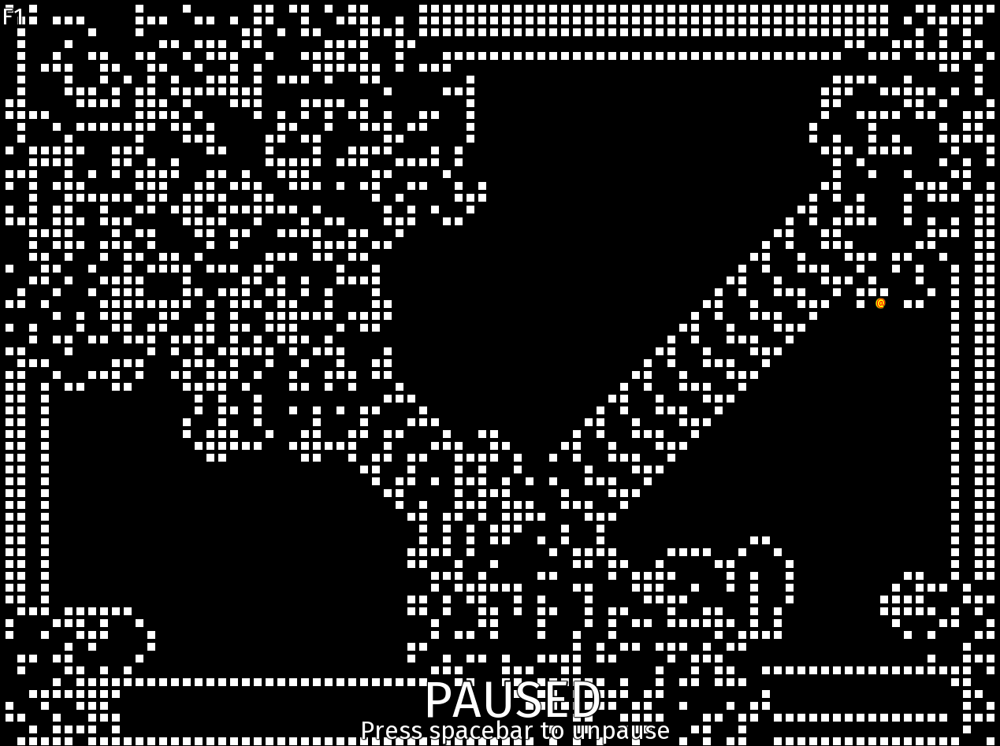

# Langton's Ant
---
## Written in Rust using the [rust-sfml](https://github.com/jeremyletang/rust-sfml) bindings

---
## Building

- Clone the repository
- Run `cargo build` or `cargo build --release`
- Performance difference between debug and release is about 30-50 frames per second on my machine

---
## Keybinds

- `Spacebar` is used for pausing/resuming the simulation
- `F1` toggles the debug panel
- `F2` toggles vsync (default: On)
- `Left Mouse` moves the ant to cursor
- `Right Mouse` toggles the state of the cell underneath the cursor